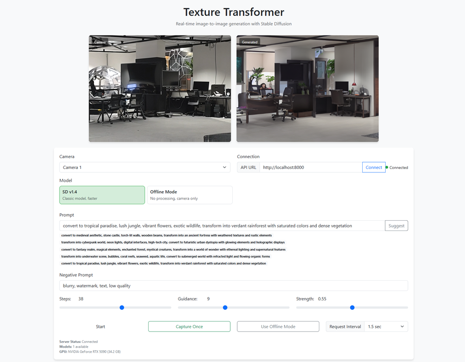

# Stable Diffusion Texture Transformer

[Demo Video](https://www.loom.com/share/b69e810249f74adab25185a8037b67e5?sid=60a01caa-e0ec-4c43-9258-9a3612a7cf0b)
[](https://texture-transformer.abhi1520.com/)

A real-time web application that transforms room textures and environments using Stable Diffusion image-to-image models. Take a photo of your surroundings and instantly transform them into different styles, themes, and textures.

## Features

- **Real-time Transformation**: Capture your surroundings via webcam and transform them instantly
- **Multiple Style Options**: Transform spaces into medieval castles, lush jungles, futuristic cyberpunk environments, and more
- **Offline Mode**: Use the application even when the AI server is not available
- **Progress Tracking**: Real-time progress updates during image generation
- **Customizable Settings**: Adjust parameters like strength, guidance scale, and steps
- **WebSocket Support**: Get live feedback during the generation process

## Getting Started

### Prerequisites

- Python 3.8+ with PyTorch
- CUDA-compatible GPU (optional but recommended)
- Modern web browser with JavaScript enabled

### Installation

1. Clone this repository:
   ```bash
   git clone https://github.com/Abhijeet1520/web-gen-art.git
   cd web-gen-art
   ```


2. Install required packages:
   ```bash
   pip install diffusers transformers fastapi uvicorn websockets torch pillow scipy
   ```

   xformers and torch versions should be compatible with your CUDA version. You can find the appropriate versions on the [PyTorch website](https://pytorch.org/get-started/locally/).
   For example, if you have CUDA 12.8, you can install with:
   ```bash
   pip install torch torchvision torchaudio --index-url https://download.pytorch.org/whl/cu128
   ```

3. Run the server:
   ```bash
   python sd_server_basic.py
   ```


4. Open `index.html` in your web browser

## Usage

1. Allow camera access when prompted
2. Select a model from the available options
3. Enter a prompt describing the desired texture/environment transformation
4. Adjust the strength slider to control how much of the original image is preserved
5. Click "Start" to begin the transformation process
6. See real-time results as they are generated

## Texture Transformation Ideas

Try these prompts to transform your surroundings:

- "Medieval stone castle with torch-lit walls and wooden beams"
- "Tropical jungle with lush vegetation and vibrant flowers"
- "Futuristic cyberpunk room with neon lights and holographic displays"
- "Winter wonderland with snow-covered furniture and icicles"
- "Underwater scene with coral reefs and bubbles floating upward"
- "Ancient temple with moss-covered stone and golden artifacts"

## Advanced Configuration

The server can be configured with various command-line options:

```bash
python sd_server_basic.py
```

## Troubleshooting

- **Port Already in Use**: Use the `--auto-port` flag to automatically find an available port
- **CUDA Out of Memory**: Try a smaller model, reduce image dimensions, or lower step count
- **Camera Not Available**: Ensure browser permissions are granted and try refreshing

## License

This code is licensed under a fully open-source [BSD-3-Clause license](./LICENSE).

Model Usage & Licenses
Many bundled models use the CreativeML OpenRAIL License. Please review it before use.

## Citation
If you find our repository useful, please consider giving it a star ⭐
